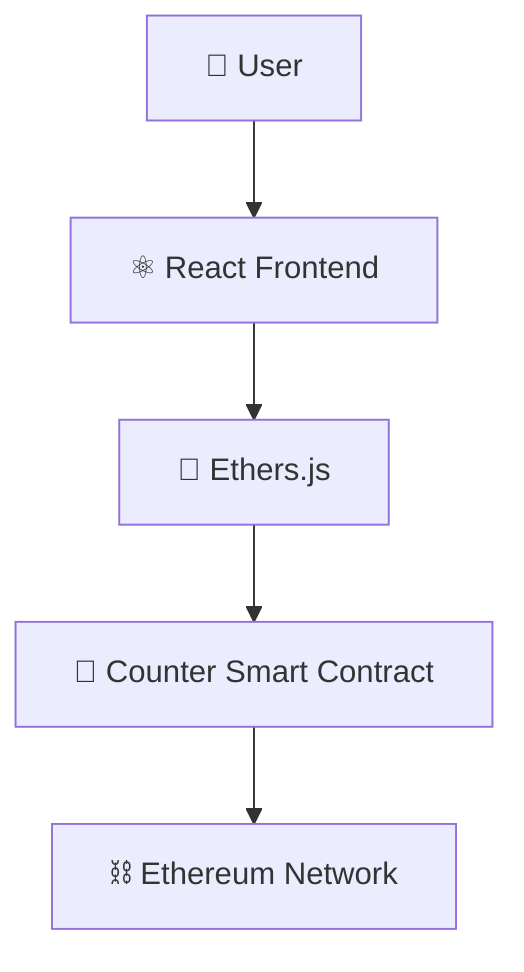

<div align="center">

# 🔢 Counter DApp

**A beginner-friendly decentralized application demonstrating on-chain state management**


</div>

---

## 📑 Table of Contents

- [Overview](#-overview)
- [Features](#-features)
- [Tech Stack](#-tech-stack)
- [Architecture](#-architecture)
- [Smart Contract Functions](#-smart-contract-functions)
- [Getting Started](#-getting-started)
- [Learning Outcomes](#-learning-outcomes)
- [Future Improvements](#-future-improvements)
- [Author](#-author)

---

## 📖 Overview

**Counter DApp** is a beginner-friendly decentralized application built using **Solidity** and **React**. The project demonstrates how smart contracts can store and update state on the blockchain while allowing users to interact with the contract through a web interface.

The application allows users to **increment** and **decrement** a counter value that is stored entirely on-chain — no centralized database, no backend server.

---

## ✨ Features

| Feature | Description |
|---|---|
| ➕ Increment Counter | Increase the on-chain counter value |
| ➖ Decrement Counter | Decrease the on-chain counter value |
| 👁️ Read Counter Value | Fetch the live value directly from the contract |
| 🔗 Smart Contract Integration | Frontend talks directly to the deployed contract |
| 👛 Wallet Connection | Connect via MetaMask or any injected wallet |
| ⚡ Real-Time Blockchain State Updates | UI reflects on-chain changes instantly |

---

## 🛠 Tech Stack

| Layer | Technologies |
|---|---|
| **Frontend** | React, JavaScript, Ethers.js |
| **Blockchain** | Solidity, Hardhat, Ethereum |

---

## 🏗 Architecture



---

## 📜 Smart Contract Functions

| Function | Type | Description |
|---|---|---|
| `increment()` | Write | Increases the stored counter by 1 |
| `decrement()` | Write | Decreases the stored counter by 1 |
| `getCount()` | Read | Returns the current counter value |

```solidity
function increment() public {
    count += 1;
}

function decrement() public {
    count -= 1;
}

function getCount() public view returns (uint256) {
    return count;
}
```

---

## 🚀 Getting Started

### Prerequisites
- Node.js (v16+)
- MetaMask browser extension
- Hardhat

### Installation

```bash
# Clone the repository
git clone https://github.com/Jeevan9898/counter-dapp.git
cd counter-dapp

# Install dependencies
npm install

# Compile the smart contract
npx hardhat compile

# Start a local blockchain
npx hardhat node

# Deploy the contract
npx hardhat run scripts/deploy.js --network localhost

# Start the frontend
cd frontend
npm install
npm start
```

---

## 🎓 Learning Outcomes

- Solidity Basics
- Smart Contract Deployment
- React + Blockchain Integration
- Ethers.js Fundamentals
- Reading and Writing Blockchain Data

---

## 🔮 Future Improvements

- [ ] Multi-user Counter
- [ ] Event Logging
- [ ] Transaction History

---

## 👤 Author

**Jeevan Yadav**

[](https://jeevan-yadav.vercel.app/)
[](https://github.com/Jeevan9898)
